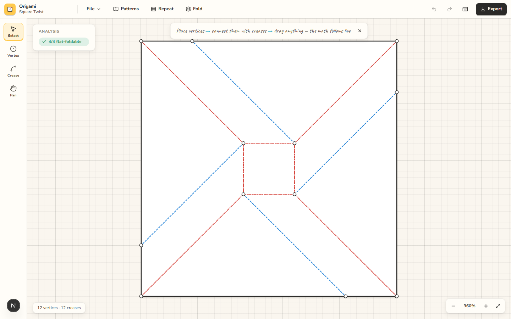

# Origami — crease pattern studio

An interactive origami mathematics and tessellation design tool. Draw a crease
pattern and the app continuously tells you whether each vertex can fold flat —
and snaps it onto the flat-foldable position when you get close.

No "check" button. Kawasaki's and Maekawa's theorems are evaluated on every
document change, including every frame of a drag, and the result appears next to
the geometry it describes.



## Quick start

```bash
npm install
npm run dev        # http://localhost:3000
```

```bash
npm test           # unit tests (Vitest)
npm run e2e        # end-to-end tests (Playwright, starts the dev server)
npm run verify     # typecheck + lint + unit + e2e - run before calling work done
```

Other scripts: `npm run build`, `npm start`, `npm run typecheck`, `npm run lint`,
`npm run test:watch`.

## What it does today

- **Tools** — select (marquee, Ctrl+A), place vertex, draw crease, pan (`V` `P` `C` `H`).
- **Live analysis** — per-vertex Kawasaki (signed residual in degrees), Maekawa
  (M − V = ±2, with a satisfiability check while creases are still unassigned),
  big-little-big, and degree-4 local layer order.
- **Snapping** — existing vertex (merge on drop) → Kawasaki locus → 15° angle →
  axis alignment → point-on-crease → grid, with screen-constant tolerances at any zoom.
- **Assignment** — mountain / valley / unassigned, drawn with origami-diagram
  conventions (dash-dot / dashed) so meaning never depends on color alone.
  The inspector can apply a Maekawa + big-little-big suggestion.
- **Planar topology** — creases auto-subdivide wherever they cross, a vertex
  dropped on a crease joins it, and dropping a vertex onto another merges them.
- **Fold preview** (`F`) — side-by-side crease pattern and a physical mass-spring
  fold. Stacking is a display heuristic, not a global foldability proof.
- **Repeat** — tile a motif in a grid, merging coincident vertices.
- **History** — one gesture is one undo step, 200 deep.
- **Files** — pattern library, JSON and FOLD import (planarized on open),
  `.origami.json`, `.fold`, and SVG export (with a mountain/valley legend).

## Architecture sketch

```
src/geometry/     pure 2D math: vectors, angles, segments, tolerances, snapping
src/origami/      document model, Kawasaki/Maekawa analysis, Kawasaki snap solver,
                  tiling, serialization, example patterns
src/editor/       viewport transform, hit testing, EditorController (all gestures)
src/state/        Zustand stores: document + undo history, editor session, analysis
src/components/   React + SVG rendering only
src/export/       SVG/JSON output
```

Dependencies point one way — `geometry ← origami ← editor/state ← components` —
and no mathematics lives in React. The document model is plain serializable data
with stable ids and pure `doc → doc` operations, so it can be ported to Swift and
mapped to the FOLD format without touching the engines.

## Documentation

Product memory lives in [`context/`](context/):

| File | Contents |
| --- | --- |
| [PRODUCT.md](context/PRODUCT.md) | What the product is, the DRAW→ANALYZE→FEEDBACK→SNAP loop, V1 scope, long-term direction |
| [ARCHITECTURE.md](context/ARCHITECTURE.md) | Layer map, key modules, rendering approach, scaling plans |
| [ORIGAMI_MATH.md](context/ORIGAMI_MATH.md) | The mathematics implemented, tolerances, the snap solver, what is *not* checked |
| [INTERACTIONS.md](context/INTERACTIONS.md) | Exact gesture, snapping, keyboard, undo, and feedback specification |
| [DESIGN_SYSTEM.md](context/DESIGN_SYSTEM.md) | Paper-craft visual identity, tokens, class inventory, what to avoid |
| [TESTING.md](context/TESTING.md) | What each suite covers and the test policy |
| [ROADMAP.md](context/ROADMAP.md) | Milestones in dependency order |
| [DECISIONS.md](context/DECISIONS.md) | Decision log with reasons and reconsideration triggers |
| [IOS.md](context/IOS.md) | Native iPhone app plan and the web→native mapping |

## Tech stack

- Next.js 16 (App Router) · React 19 · TypeScript 5
- Tailwind CSS 4 with custom design tokens in `src/app/globals.css`
- Zustand for state · Radix UI primitives (headless, styled locally) · lucide-react
  icons · `motion` for chrome transitions
- Nunito + Caveat via `next/font/google`
- Vitest + Testing Library · Playwright (desktop Chromium, installed Edge smoke, iPhone metrics)

## License

None yet — all rights reserved by default. Add a license before publishing or
accepting contributions.
